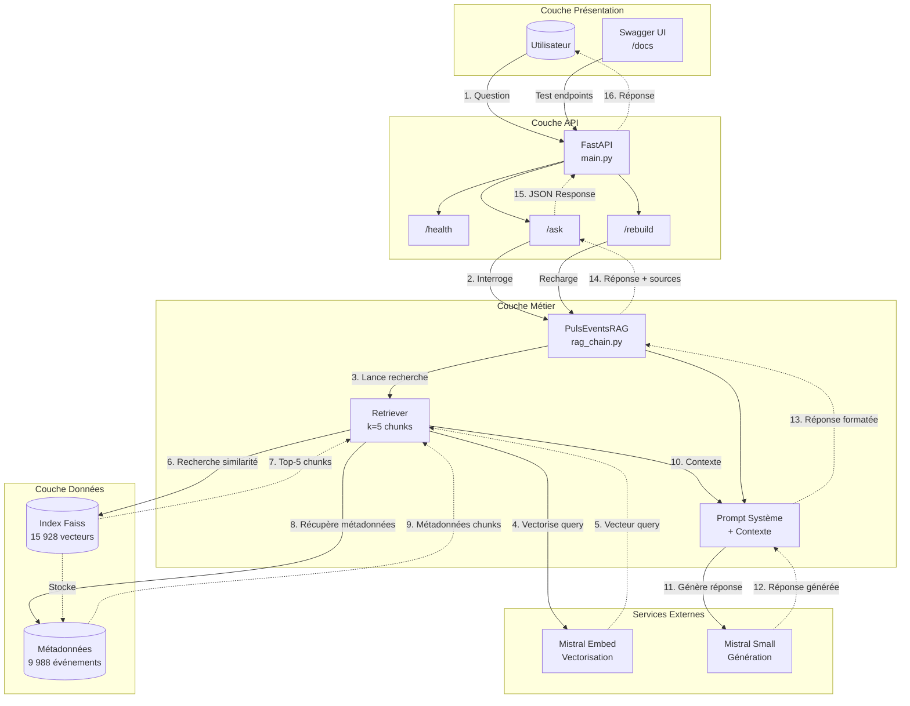

# Puls-Events RAG - Assistant intelligent de recommandation d'événements culturels


---

## Table des matières

1. [Contexte du projet](#contexte-du-projet)
2. [Architecture technique](#architecture-technique)
3. [Préparation des données](#préparation-des-données)
4. [Métriques du projet](#métriques-du-projet)
5. [Structure du projet](#structure-du-projet)
6. [Installation](#installation)
7. [Utilisation](#utilisation)
8. [API REST](#api-rest)
9. [Conteneurisation Docker](#conteneurisation-docker)
10. [Système RAG](#système-rag)
11. [Tests](#tests)
12. [Évaluation du système](#évaluation-du-système)
13. [Configuration avancée](#configuration-avancée)
14. [Améliorations futures](#améliorations-futures)
15. [Licence](#licence)
16. [Auteur](#auteur)

---

## Contexte du projet

Projet académique - Formation Expert en Ingénierie et Science des Données

**Objectif** : Développer un système RAG (Retrieval-Augmented Generation) complet pour Puls-Events, une plateforme de recommandations culturelles personnalisées.

**Mission** : Créer un chatbot intelligent capable de répondre aux questions des utilisateurs sur les événements culturels à Paris et en Île-de-France, en s'appuyant sur les données de l'API Open Agenda.

**Livrables** :
- POC (Proof of Concept) pour Puls-Events, plateforme de recommandations culturelles
- Système RAG fonctionnel avec recherche sémantique et génération de réponses
- API REST exposant le système via FastAPI
- Pipeline de preprocessing complet et reproductible
- Tests unitaires avec couverture complète
- Documentation technique et rapport d'évaluation
- Conteneurisation Docker pour déploiement local

---

## Architecture technique

### Stack principale

| Composant | Technologie | Version | Rôle |
|-----------|-------------|---------|------|
| **Embeddings** | Mistral AI | `mistral-embed` | Vectorisation sémantique (1024 dimensions) |
| **LLM** | Mistral AI | `mistral-small-latest` | Génération de réponses en langage naturel |
| **Framework RAG** | LangChain | 0.3.x | Orchestration retrieval + génération |
| **Base vectorielle** | Faiss | 1.9.x | Recherche sémantique (IndexFlatL2) |
| **API REST** | FastAPI | 0.115.x | Exposition des endpoints |
| **Conteneurisation** | Docker | latest | Déploiement reproductible |
| **Gestionnaire de packages** | uv | latest | Gestion des dépendances |

### Workflow du système

```
┌─────────────────────────────────────────────────────────────┐
│                    UTILISATEUR                              │
└──────────────────────┬──────────────────────────────────────┘
                       │ Question en langage naturel
                       ▼
┌──────────────────────────────────────────────────────────────┐
│                    API REST (FastAPI)                        │
│  Endpoints: /ask, /health, /rebuild                          │
└──────────────────────┬───────────────────────────────────────┘
                       │
                       ▼
┌──────────────────────────────────────────────────────────────┐
│               SYSTÈME RAG (LangChain)                        │
│                                                              │
│  ┌────────────────────────┐   ┌──────────────────────────┐   │
│  │   1. RETRIEVAL         │   │   2. GENERATION          │   │
│  │                        │   │                          │   │
│  │  - Vectorisation query │──▶│  - Prompt système        │   │
│  │  - Recherche Faiss(k=5)│   │  - Contexte (chunks)     │   │
│  │  - Top-5 chunks        │   │  - Mistral LLM           │   │
│  │                        │   │  - Réponse générée       │   │
│  └────────────────────────┘   └──────────────────────────┘   │
│                                                              │
└──────────────────────┬───────────────────────────────────────┘
                       │
                       ▼
┌──────────────────────────────────────────────────────────────┐
│            BASE VECTORIELLE FAISS                            │
│  - 15 928 vecteurs (1024 dimensions)                         │
│  - 9 988 événements culturels                                │
│  - Métadonnées complètes (titre, lieu, date, etc.)           │
└──────────────────────────────────────────────────────────────┘
```

### Diagramme de composants (UML)


---

## Préparation des données

### Source de données

Les données proviennent de l'API OpenDataSoft (dataset `evenements-publics-openagenda`), filtrées sur la région Ile-de-France pour la période du 1er janvier 2025 au 31 décembre 2026. La collecte a permis de récupérer 10 000 événements culturels via un script de collecte paginé avec retry logic et gestion du rate limiting.

### Nettoyage et normalisation

Le nettoyage des données a permis de passer de 10 000 à 9 988 événements (taux de rétention : 99.9%). Les traitements suivants ont été appliqués :

**Nettoyage HTML** : Suppression des balises présentes dans les descriptions longues (p, br, strong, a, em, h2, h3, ul, li) et décodage des entités HTML (&nbsp;, &amp;, &eacute;, etc.). 96.4% des événements contenaient du HTML dans le champ `longdescription_fr`.

**Normalisation des départements** : Correction de plus de 20 variantes identifiées lors de l'exploration des données. Exemples d'anomalies corrigées :
- Val-D'Oise / Val-d'Oise (casse de l'apostrophe)
- Seine-St-Denis / Seine-Saint-Denis (abréviation)
- Codes postaux (75010, 75011, ..., 75018) remappés vers "Paris"

**Normalisation des villes** : Standardisation de la casse (PARIS vers Paris). 143 corrections appliquées.

**Normalisation des mots-clés** : Conversion en minuscules et déduplication (théatre / Théatre, musique / Musique).

**Exclusions** : 4 événements sans titre ou description, 8 événements hors Ile-de-France (Métropole de Lyon, Nord).

### Structuration pour le RAG

Chaque événement nettoyé est transformé en un texte structuré pour l'embedding, au format suivant :

```
Titre: [title_fr]
Description: [description_fr]
Détails: [longdescription_fr - tronqué à 1000 caractères]
Lieu: [location_name], [city], [department]
Date: [daterange_fr]
Mots-clés: [keywords_fr]
Conditions: [conditions_fr]
```

13 champs de métadonnées sont extraits et conservés pour chaque événement (uid, title, description, date_range, date_start, date_end, location_name, city, department, url, image, keywords, conditions).

### Chunking

Le découpage des textes est réalisé avec le `RecursiveCharacterTextSplitter` de LangChain, qui recherche des points de coupure naturels selon une hiérarchie de séparateurs :

| Paramètre | Valeur |
|-----------|--------|
| Taille cible | 800 caractères |
| Overlap | 100 caractères |
| Taille minimale | 100 caractères |
| Séparateurs | `\n\n`, `\n`, `. `, ` `, `""` |

Résultats : 15 928 chunks générés à partir de 9 988 événements (ratio de 1.59 chunk par événement). 52% des événements produisent un seul chunk, 48% sont découpés en 2 à 3 chunks.

### Vectorisation

Les embeddings sont générés avec le modèle `mistral-embed` de Mistral AI (1024 dimensions). Le script de vectorisation intègre un système de checkpoints (sauvegarde tous les 50 batches) permettant la reprise automatique en cas d'interruption, ainsi qu'un retry avec backoff exponentiel pour gérer le rate limiting de l'API.

| Paramètre | Valeur |
|-----------|--------|
| Modèle | mistral-embed |
| Dimension | 1024 |
| Batch size | 50 textes |
| Vecteurs générés | 15 928 |
| Taille de la matrice | 62.22 MB |

---

## Métriques du projet

### Données et infrastructure

| Métrique | Valeur | Description |
|----------|--------|-------------|
| **Événements collectés** | 10 000 | Données brutes de l'API Open Agenda |
| **Événements après nettoyage** | 9 988 | Taux de rétention : 99.9% |
| **Chunks créés** | 15 928 | Découpage intelligent avec RecursiveCharacterTextSplitter |
| **Vecteurs indexés** | 15 928 | Embeddings Mistral (1024 dimensions) |
| **Taille de l'index Faiss** | 80.85 MB | Index + métadonnées |
| **Période couverte** | 2025-2026 | Événements 2025 : 9 546 (95.6%), Événements 2026 : 458 (4.6%) |
| **Zone géographique** | Île-de-France | 8 départements, 698 villes |
| **Tests unitaires** | 201 tests | Couverture : 100% |

### Performance du système RAG

| Métrique | Valeur | Standard industrie | Évaluation |
|----------|--------|-------------------|------------|
| **Similarité sémantique moyenne** | 93.6% | 85-90% | Excellent |
| **Exact matches** | 0/17 (0%) | 5-15% | Ok pour RAG génératif |
| **Partial matches** | 2/17 (11.8%) | 40-60% | À améliorer |
| **Rappel retrieval moyen** | 52.7% | 70%+ | Acceptable pour POC |
| **Classification automatique** | 17/17 (100%) | 90%+ | Excellent |
| **Temps de réponse moyen** | ~5 secondes | <10s | Acceptable |

**Axes d'amélioration** :
- Rappel retrieval (52.7% vs 70%+ production) : augmenter k, affiner le chunking, utiliser un reranker
- Partial matches (11.8% vs 40-60% standard) : optimiser le prompt système ou ajuster la température

---

## Structure du projet

```
.
├── notebooks/                          # Notebooks d'exploration
│   └── 01_exploration_data.ipynb
├── scripts/                            # Scripts d'orchestration                
│   └── build_index.py                  # Build complet du pipeline
├── src/
│   ├── api/                            # API REST FastAPI
│   │   ├── main.py                     # Application FastAPI (3 endpoints)
│   │   └── schemas.py                  # Modèles Pydantic
│   ├── data/
│   │   ├── evaluation/                 # Jeu de test annoté (17 questions)
│   │   ├── processed/                  # Données traitées et index Faiss
│   │   └── raw/                        # Données brutes de l'API
│   ├── preprocessing/                  # Pipeline de preprocessing (5 scripts)
│   │   ├── chunk_events.py             # Découpage avec LangChain
│   │   ├── clean_events.py             # Nettoyage HTML, normalisation
│   │   ├── fetch_events.py             # Collecte depuis Open Agenda
│   │   ├── prepare_for_vectorization.py
│   │   └── vectorize_events.py         # Embeddings Mistral avec checkpoints
│   ├── rag/                            # Système RAG avec LangChain
│   │   ├── evaluation.py               # Évaluation automatique du RAG
│   │   ├── rag_chain.py                # Classe principale PulsEventsRAG 
│   │   └── test_set_loader.py          # Chargeur du jeu de test
│   └── vectorstore/                    # Indexation Faiss
│       └── faiss_index.py              # Création et chargement de l'index
├── tests/                              # Tests unitaires
│   ├── test_api.py                  
│   ├── test_imports.py
│   ├── test_mistral_api
│   ├── test_preprocessing.py       
│   ├── test_rag.py                  
│   └── test_vectorstore.py          
├── .dockerignore                       # Exclusions Docker
├── Dockerfile                          # Image Docker de l'API
├── .env.example                        # Template des variables d'environnement
├── .gitignore                          # Exclusions github
├── .python-version                  
├── Dockerfile                          # Script de construction de l'image
├── pyproject.toml                      # Configuration uv
├── README.md                           # Documentation principale
├── requirements.txt                    # Dépendances avec hashes
└── uv.lock                             # Lockfile uv
```

---

## Installation

### Prérequis

- Python 3.11+
- [uv](https://docs.astral.sh/uv/) (gestionnaire de packages)
- Clé API [Mistral AI](https://mistral.ai)
- Docker (optionnel, pour conteneurisation)

### Étapes d'installation

#### 1. Cloner le dépôt

```bash
git clone https://github.com/Eqqinox/puls-events-rag.git
cd puls-events-rag
```

#### 2. Créer l'environnement virtuel

```bash
uv venv
source .venv/bin/activate  # Linux/macOS
# ou .venv\Scripts\activate sur Windows
```

#### 3. Installer les dépendances

```bash
uv sync
```

#### 4. Configurer les variables d'environnement

```bash
cp .env.example .env
# Éditer .env et ajouter votre clé API Mistral
```

Contenu du fichier `.env` :
```bash
MISTRAL_API_KEY=cle_api_mistral
```

**Important** : Ne jamais commiter le fichier `.env`
#### 5. Vérifier l'installation

```bash
python tests/test_imports.py
```

Si tous les imports passent, l'installation est réussie.

---

## Utilisation

### Option 1 : Pipeline complet

Le script `build_index.py` exécute automatiquement toutes les étapes du pipeline :

```bash
python scripts/build_index.py
```

Ce script :
1. Collecte les événements depuis l'API Open Agenda
2. Nettoie et normalise les données
3. Structure les données pour le RAG
4. Découpe en chunks avec RecursiveCharacterTextSplitter
5. Génère les embeddings Mistral avec système de checkpoints
6. Crée l'index Faiss IndexFlatL2

### Option 2 : Exécution manuelle étape par étape

```bash
# 1. Collecte des données depuis l'API Open Agenda
python src/preprocessing/fetch_events.py

# 2. Nettoyage des données (HTML, normalisation départements/villes)
python src/preprocessing/clean_events.py

# 3. Structuration pour le RAG
python src/preprocessing/prepare_for_vectorization.py

# 4. Découpage en chunks (RecursiveCharacterTextSplitter)
python src/preprocessing/chunk_events.py

# 5. Vectorisation avec Mistral Embeddings
python src/preprocessing/vectorize_events.py

# 6. Création de l'index Faiss
python src/vectorstore/faiss_index.py
```

### Fichiers générés

Après exécution du pipeline :

```
src/data/
├── processed/
│   ├── exploration_stats.json        # Statistiques d'exploration
│   ├── events_cleaned.json           # 9 988 événements nettoyés
│   ├── events_for_vectorization.json
│   ├── events_chunked.json           # 15 928 chunks
│   ├── events_vectorized.json        # Métadonnées des vecteurs
│   ├── embeddings.npy                # Matrice (15 928, 1024) - 65,2 MB
│   └── faiss_index/                  # Index Faiss (86.2 MB)
│       ├── index.faiss               # Index vectoriel
│       └──  index.pkl                # Métadonnées sérialisées
├── raw/
    └── events_raw.json               # 10 000 événements bruts
```

---

## API REST

L'API expose le système RAG via 3 endpoints FastAPI.

### Lancement de l'API

```bash
# En mode développement (avec hot-reload)
uvicorn src.api.main:app --reload

# En mode production
uvicorn src.api.main:app --host 0.0.0.0 --port 8000
```

L'API sera accessible sur `http://localhost:8000`

**Documentation automatique** :
- Swagger UI : http://localhost:8000/docs
- ReDoc : http://localhost:8000/redoc

### Endpoints disponibles

#### 1. GET /health

Vérification de l'état de l'API

```bash
curl http://localhost:8000/health
```

**Réponse** :
```json
{
  "status": "ok"
}
```

**Codes HTTP** :
- 200 : API opérationnelle
- 503 : Service non disponible

---

#### 2. POST /ask

Poser une question au système RAG

```bash
curl -X POST "http://localhost:8000/ask" \
  -H "Content-Type: application/json" \
  -d '{"question": "Quels concerts de jazz à Paris en janvier 2026 ?"}'
```

**Réponse** :
```json
{
  "answer": "Plusieurs concerts de jazz sont prévus à Paris en janvier 2026...",
  "sources": [
    {
      "title": "THE BLAKETTES 'The Art Blakey Women's Band'",
      "location": "Paris",
      "date": "Samedi 17 janvier 2026, 19h30",
      "url": "https://openagenda.com/jass-club-paris/events/..."
    }
  ]
}
```

**Codes HTTP** :
- 200 : Réponse générée avec succès
- 400 : Requête invalide (question vide)
- 422 : Erreur de validation des données
- 500 : Erreur interne du serveur
- 503 : Service non disponible

**Fonctionnalités avancées** :
- Injection automatique de la date actuelle dans le prompt système
- Injection des statistiques de la base (9 988 événements, répartition 2025/2026)
- Interprétation des requêtes temporelles ("ce weekend", "cette semaine")
- Gestion des questions hors sujet et hors zone géographique
- Réponses correctes aux questions de comptage ("Combien d'événements en 2026 ?" → 458)

---

#### 3. POST /rebuild

Recharger l'index Faiss (après mise à jour des données)

```bash
curl -X POST "http://localhost:8000/rebuild"
```

**Réponse** :
```json
{
  "status": "success",
  "message": "Index Faiss rechargé avec succès"
}
```

**Codes HTTP** :
- 200 : Index rechargé avec succès
- 500 : Erreur lors du rechargement de l'index

---

## Conteneurisation Docker

Le projet est entièrement conteneurisé pour un déploiement reproductible.

### Build de l'image Docker

```bash
docker build -t puls-events-api .
```

**Taille de l'image** : ~1.2 GB (Python 3.11-slim + dépendances + index Faiss)

### Lancement du conteneur

```bash
# Mode détaché (background)
docker run -d \
  --name puls-events-api \
  -p 8000:8000 \
  --env-file .env \
  puls-events-api

# Vérifier les logs
docker logs -f puls-events-api

# Arrêter le conteneur
docker stop puls-events-api
```

### Tests de l'API conteneurisée

```bash
# Health check
curl http://localhost:8000/health

# Test du endpoint /ask
curl -X POST "http://localhost:8000/ask" \
  -H "Content-Type: application/json" \
  -d '{"question": "Expositions d'\''art contemporain en Île-de-France ?"}'

# Documentation Swagger
open http://localhost:8000/docs
```

**Documentation complète** : Voir [README_DOCKER.md](docs/README_DOCKER.md)

---

## Système RAG

### Architecture du prompt système

Le prompt système injecte automatiquement :
- **Date actuelle** : Générée via `datetime.now()` à chaque démarrage de l'API
- **Statistiques de la base** : Total événements, répartition 2025/2026, pourcentages
- **Règles de comportement** : 12 règles définissant le comportement du chatbot

**Fichier** : `src/rag/rag_chain.py` → fonction `get_system_prompt()`

### Paramètres du modèle

| Paramètre | Valeur | Description |
|-----------|--------|-------------|
| `model` | `mistral-small-latest` | Modèle LLM Mistral |
| `temperature` | 0.3 | Déterminisme élevé (0 = très déterministe, 1 = créatif) |
| `max_tokens` | 500 | Longueur maximale de la réponse générée |
| `k` | 5 | Nombre de chunks récupérés par Faiss |
| `search_type` | `similarity` | Recherche par similarité cosinus |

### Utilisation programmatique

```python
from src.rag.rag_chain import PulsEventsRAG

# Initialiser le système RAG
rag = PulsEventsRAG()

# Poser une question (réponse seule)
response = rag.ask("Quels concerts de jazz à Paris ce weekend ?")
print(response)

# Poser une question avec sources
result = rag.ask_with_sources("Théâtre pour enfants en février ?")
print(result["answer"])
print(f"Nombre de sources : {result['num_sources']}")

for source in result["sources"]:
    print(f"- {source.metadata['title']} à {source.metadata['city']}")

# Récupérer les chunks pertinents sans générer de réponse
chunks = rag.get_relevant_chunks("Expositions d'art contemporain", k=10)
for chunk in chunks:
    print(f"Score : {chunk['score']:.4f}")
    print(f"Titre : {chunk['metadata']['title']}")
```

---

## Tests

### Exécution des tests

```bash
# Tous les tests
pytest tests/ -v

# Tests par module
pytest tests/test_preprocessing.py -v
pytest tests/test_vectorstore.py -v 
pytest tests/test_rag.py -v
pytest tests/test_api.py -v
pytest tests/test_mistral_api.py -v

# Avec couverture
pytest tests/ -v --cov=src --cov-report=html

```

### Résultats attendus

| Module | Tests | Statut |
|--------|-------|--------|
| `test_imports.py` | Vérification des imports | PASSED |
| `test_preprocessing.py` | 85 tests | 100% PASSED |
| `test_vectorstore.py` | 39 tests | 100% PASSED |
| `test_rag.py` | 49 tests | 100% PASSED |
| `test_api.py` | 16 tests | 100% PASSED |
| `test_evaluation.py` | 12 tests | 100% PASSED |
| **Total** | **201 tests** | **100% PASSED** |

---

## Évaluation du système

### Jeu de test annoté

**Fichier** : `src/data/evaluation/test_set.json`

Le jeu de test contient 17 questions annotées manuellement couvrant :
- Questions par lieu + thème + date (ex: "Concerts de jazz à Paris en janvier 2026")
- Questions par thème + public (ex: "Théâtre pour enfants")
- Questions vagues (ex: "Événement culturel original et atypique")
- Questions hors sujet (ex: "Quelle est la capitale de la France ?")
- Questions hors zone géographique (ex: "Événements culturels à Lyon ?")

**Distribution de difficulté** :
- Easy : 7 questions
- Medium : 8 questions
- Hard : 2 questions

### Exécution de l'évaluation

```bash
python src/rag/evaluation.py
```

Le script génère un rapport JSON dans `src/data/evaluation/evaluation_results.json` avec :
- Métriques globales (similarité sémantique, exact matches, partial matches)
- Métriques de retrieval (rappel moyen par thème et localisation)
- Classification automatique des questions
- Détails par question (réponse générée, score, chunks récupérés)

### Métriques calculées

| Métrique | Description | Méthode |
|----------|-------------|---------|
| **Similarité sémantique** | Cohérence entre réponse générée et référence | Embeddings Mistral + similarité cosinus |
| **Exact match** | Correspondance exacte (insensible à la casse) | Normalisation de chaînes |
| **Partial match** | Chevauchement de mots significatifs | Intersection de mots après lemmatisation |
| **Rappel retrieval** | % de thèmes/lieux attendus trouvés dans les chunks | Recherche de mots-clés dans métadonnées |
| **Classification** | Catégorisation automatique de la question | Analyse des mots-clés |

---

## Configuration avancée

### Paramètres de chunking

Fichier : `src/preprocessing/chunk_events.py`

```python
CHUNK_SIZE = 800        # Taille cible du chunk (caractères)
CHUNK_OVERLAP = 100     # Chevauchement entre chunks (caractères)
MIN_CHUNK_SIZE = 100    # Taille minimale d'un chunk
```

**Méthode** : `RecursiveCharacterTextSplitter` de LangChain avec séparateurs hiérarchiques :
```python
separators = ["\n\n", "\n", ". ", " ", ""]
```

### Paramètres de vectorisation

Fichier : `src/preprocessing/vectorize_events.py`

```python
MODEL = "mistral-embed"   # Modèle d'embeddings Mistral AI
BATCH_SIZE = 50           # Nombre de chunks par batch API
CHECKPOINT_FREQ = 50      # Fréquence de sauvegarde (tous les N batches)
MAX_RETRIES = 5           # Nombre de tentatives en cas d'erreur
RATE_LIMIT_WAIT = 1       # Délai entre les batches (secondes)
```

**Fonctionnalités** :
- Système de checkpoints pour reprise automatique après interruption
- Retry intelligent avec backoff exponentiel
- Gestion des erreurs 429 (rate limiting)
- Sauvegarde d'urgence avant crash

### Paramètres de l'index Faiss

Fichier : `src/vectorstore/faiss_index.py`

```python
INDEX_TYPE = faiss.IndexFlatL2   # Recherche exacte par distance L2
DIMENSION = 1024                 # Dimension des vecteurs Mistral
```

**Type d'index** : `IndexFlatL2` (recherche exhaustive exacte)
- Avantage : Précision maximale (pas d'approximation)
- Inconvénient : Temps de recherche linéaire O(n)
- Adapté pour : Bases de 10k-100k vecteurs

Pour des bases plus grandes (>1M vecteurs), considérer `IndexIVFFlat` ou `IndexHNSW`.

---

### Notebooks d'exploration

| Notebook | Description |
|----------|-------------|
| `notebooks/01_exploration_data.ipynb` | Analyse exploratoire des données Open Agenda |

---

## Améliorations futures

### Court terme
- Augmenter le paramètre k (nombre de chunks récupérés) pour améliorer le rappel retrieval
- Optimiser le prompt système pour augmenter les partial matches
- Ajouter un endpoint `/stats` pour exposer les statistiques de la base
- Implémenter un cache Redis pour les requêtes fréquentes

### Moyen terme
- Implémenter un reranker pour améliorer la pertinence des chunks récupérés
- Ajouter un système de feedback utilisateur (thumbs up/down)
- Créer une interface web avec Streamlit ou Gradio
- Mettre en place un monitoring avec Prometheus + Grafana

### Long terme
- Migrer vers un index Faiss approximatif (IndexIVFFlat) pour passage à l'échelle
- Implémenter le RAG Fusion (multi-query retrieval)
- Déployer sur le cloud (AWS, GCP, ou Azure)

---

## Licence

Projet académique - Formation Expert en Ingénierie et Science des Données

Ce projet a été réalisé dans le cadre d'un parcours de formation et n'est pas destiné à un usage commercial.

---

## Auteur

**Mounir Meknaci**

- Email : meknaci81@gmail.com
- LinkedIn : [Mounir Meknaci](https://www.linkedin.com/in/mounir-meknaci/)
- Formation : Expert en ingénierie et science des données
- Projet : Concevez et déployez un système RAG

---

*Dernière mise à jour: Janvier 2026*  
*Projet puls-events-rag  - OpenClassrooms*.  
*Auteur : Mounir Meknaci*.  
*Version : 1.0*
